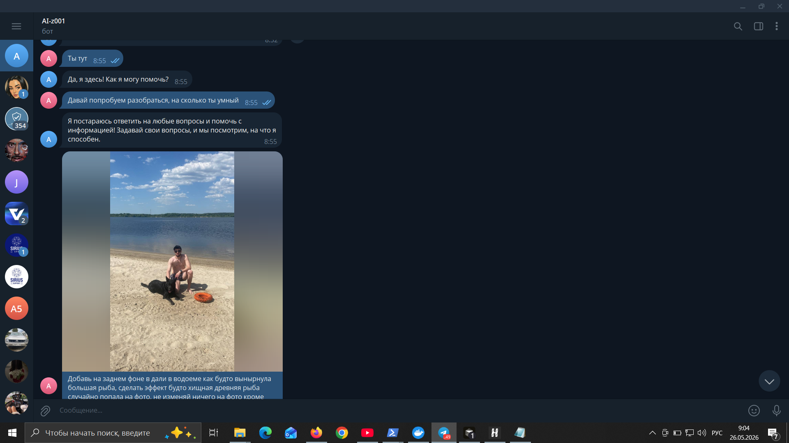
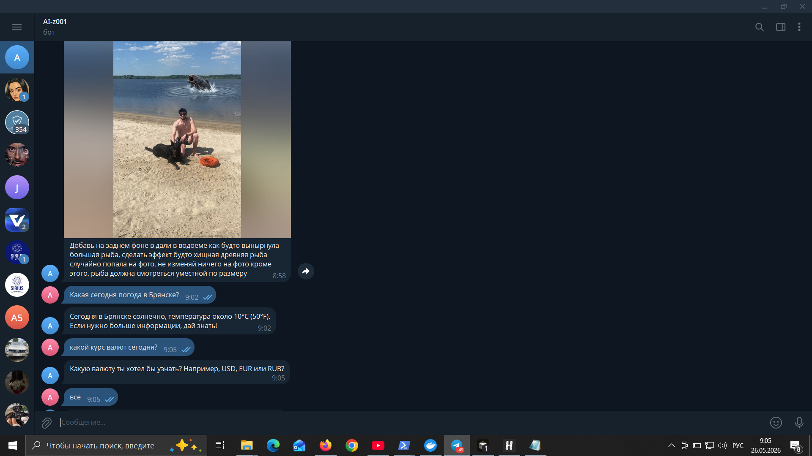
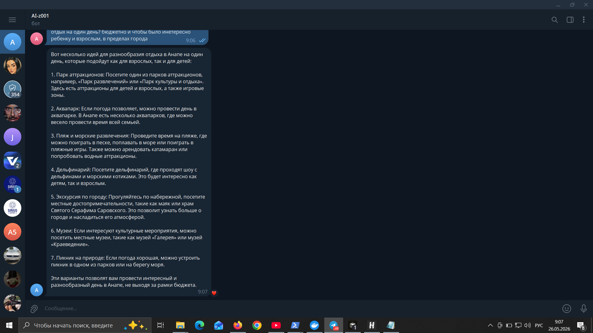
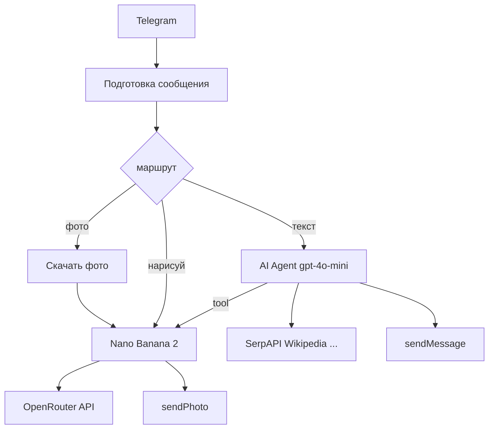

# Telegram AI-ассистент на n8n + OpenRouter

Self-hosted workflow для [n8n](https://n8n.io): Telegram-бот с памятью диалога, инструментами (поиск, погода, курсы валют) и **генерацией/редактированием изображений** через [OpenRouter](https://openrouter.ai) (модель **Nano Banana 2** — `google/gemini-3.1-flash-image-preview`).

Текстовый «мозг» агента: **gpt-4o-mini**. Картинки обрабатываются отдельным HTTP-вызовом к image-модели, не заменяя chat-модель.

## Скриншоты

| Запрос с фото | Результат правки | Диалог с агентом |
|:---:|:---:|:---:|
|  |  |  |

- **Слева:** фото + подпись с инструкцией правки  
- **По центру:** отредактированное изображение и последующие вопросы (погода, курсы)  
- **Справа:** обычный диалог с памятью (рекомендации, факты и т.д.)

## Возможности

- Диалог на русском с **памятью** (~15 сообщений на чат)
- **Calculator**, **Wikipedia**, **Погода** (wttr.in), **SerpAPI**, **Курсы валют**, **Think**
- **Изображения (Nano Banana 2):**
  - Фото + подпись → редактирование
  - `нарисуй …` → генерация с нуля
  - После фото: «улучши фото», «сделай ч/б» → правка по кэшу
  - Tool **Редактор_изображений** — по запросу в свободной форме через агента

## Требования

| Компонент | Версия / примечание |
|-----------|---------------------|
| n8n | **2.21.7+**, self-hosted |
| Публичный URL | `N8N_WEBHOOK_URL` (HTTPS) для Telegram webhook |
| Telegram | Bot token ([@BotFather](https://t.me/BotFather)) |
| OpenRouter | API key, баланс на image-модели |
| SerpAPI | Ключ ([serpapi.com](https://serpapi.com)) — ~100 запросов/мес бесплатно |

## Быстрый старт

1. Клонируйте репозиторий.
2. В n8n: **Workflows → Import from File** → [`workflows/n8n-telegram-openrouter-agent.json`](workflows/n8n-telegram-openrouter-agent.json).
3. Создайте credentials:
   - **Telegram API** — токен бота (все узлы Telegram + Trigger).
   - **Header Auth** (`httpHeaderAuth`) — имя заголовка `Authorization`, значение `Bearer <OPENROUTER_API_KEY>` — для узлов **Nano Banana 2 OpenRouter** и **Редактор_изображений**.
   - **SerpAPI** — для узла SerpAPI.
4. Во всех красных узлах выберите созданные credentials (в JSON стоят плейсхолдеры `REPLACE_OPENROUTER_HEADER_CRED_ID`).
5. Убедитесь, что `N8N_WEBHOOK_URL` указывает на ваш инстанс.
6. **Activate** workflow и напишите боту в Telegram.

Подробнее: [docs/SETUP.md](docs/SETUP.md).

## Использование в Telegram

| Действие | Пример |
|----------|--------|
| Правка фото | Отправьте **фото** с **подписью**: «добавь на фоне рыбу в воде» |
| Генерация | `нарисуй закат над морем` |
| Правка кэша | После фото: «улучши фото» / «сделай чёрно-белым» |
| Обычный чат | Любой текст — агент + инструменты |
| Справка | `/help`, `/start` |

## Архитектура



## Структура репозитория

```text
.
├── README.md
├── LICENSE
├── .env.example
├── workflows/
│   └── n8n-telegram-openrouter-agent.json
├── screenshots/
│   ├── telegram-photo-request.png
│   ├── telegram-photo-result.png
│   └── telegram-agent-chat.png
└── docs/
    └── SETUP.md
```

## Стоимость и ограничения

- **gpt-4o-mini** и **gemini-3.1-flash-image-preview** тарифицируются отдельно на [OpenRouter](https://openrouter.ai/models).
- Генерация/правка изображения: обычно **15–120 секунд**.
- Telegram: лимит размера фото ~10 MB; очень большие снимки могут не пройти в API.
- Результат правки — **AI-интерпретация** запроса, не пиксель-в-пиксель редактор.

## Устранение неполадок

| Симптом | Что проверить |
|---------|----------------|
| `Unknown error` в Code после фото | Узел **Скачать фото**: Download = true, credential Telegram; переимпортируйте актуальный workflow (fix `getBinaryDataBuffer(0, 'data')`) |
| Только текст вместо картинки | OpenRouter credential, баланс, в Execution — есть ли `message.images` в ответе |
| SerpAPI не работает | Credential SerpAPI в узле tool |
| Webhook не срабатывает | `N8N_WEBHOOK_URL`, firewall, HTTPS |

## Лицензия

[MIT](LICENSE) — используйте и изменяйте свободно, на свой риск.

---

## English (brief)

**Telegram AI assistant** built as an n8n workflow: conversational agent (OpenRouter `gpt-4o-mini`) with tools (search, weather, FX rates) and **image generation/editing** via OpenRouter **Nano Banana 2** (`google/gemini-3.1-flash-image-preview`).

**Quick start:** import [`workflows/n8n-telegram-openrouter-agent.json`](workflows/n8n-telegram-openrouter-agent.json), set Telegram + OpenRouter (Header Auth `Bearer …`) + SerpAPI credentials, activate workflow.

**Image usage:** send a **photo with caption** to edit, or message `нарисуй …` to generate. See [docs/SETUP.md](docs/SETUP.md) for details.

Licensed under [MIT](LICENSE).
